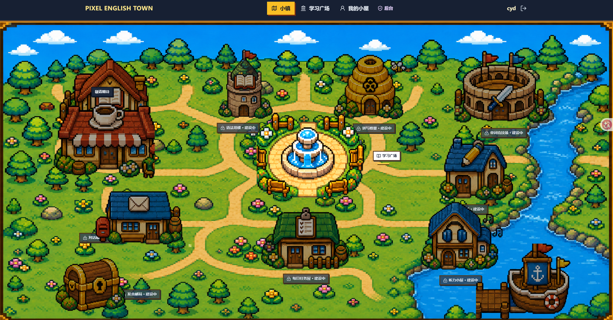
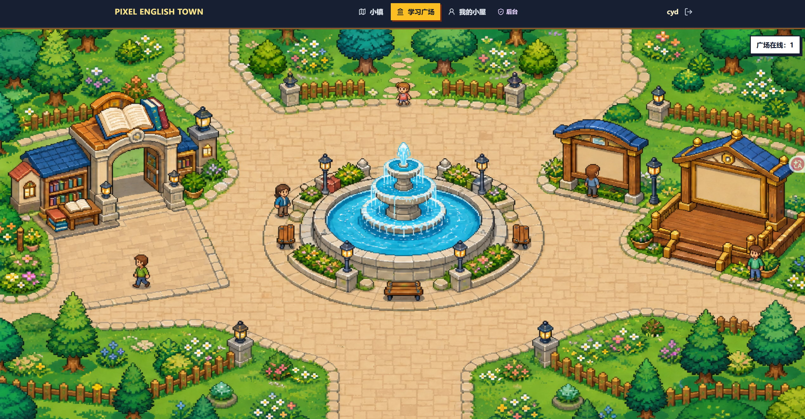
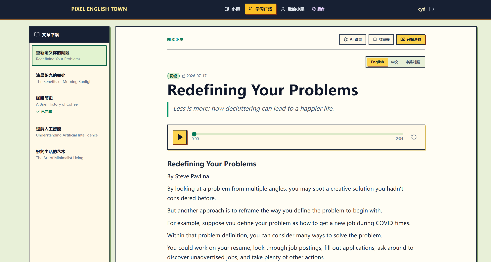
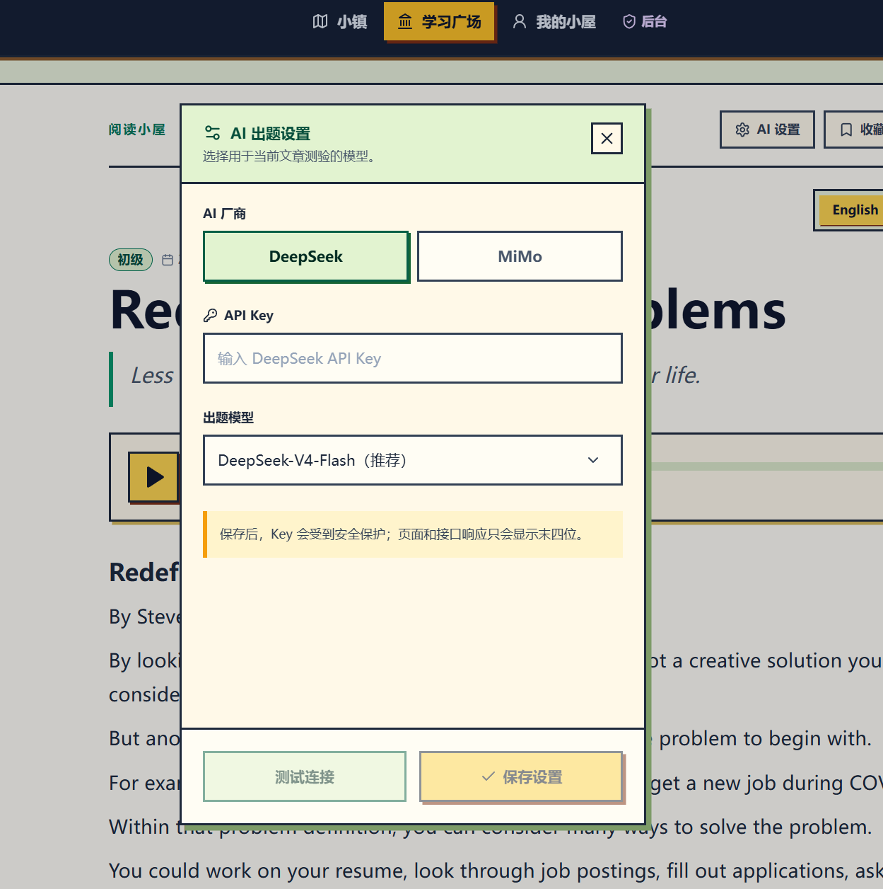
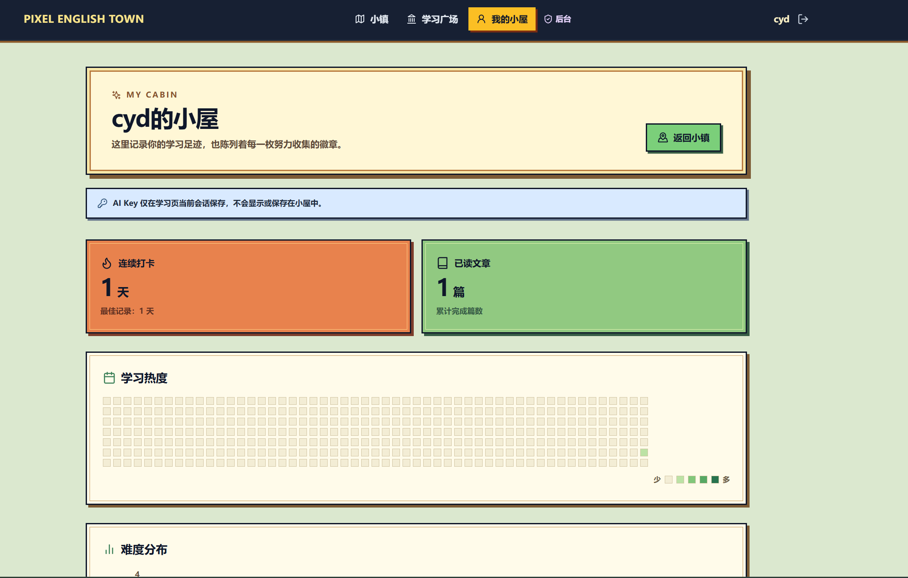
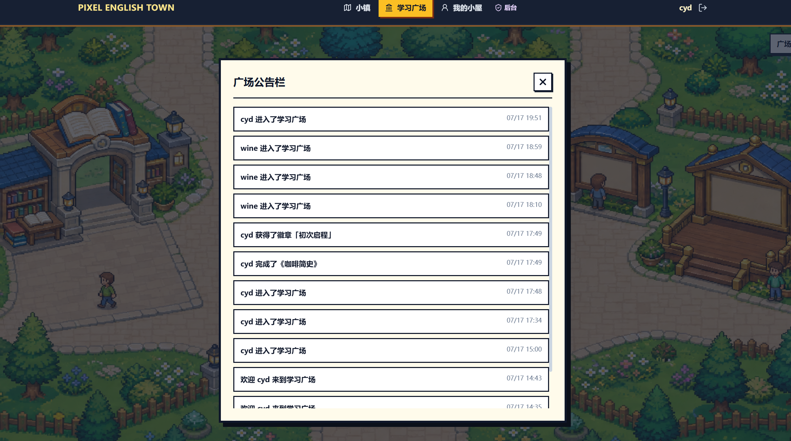
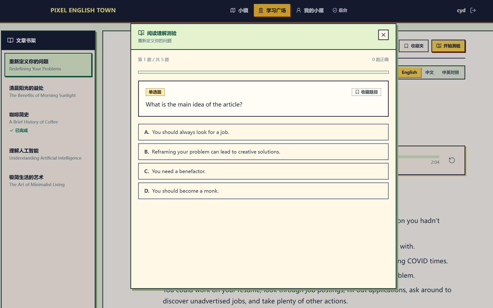

# 像素英语小镇 (Pixel English Town)

像素风格的英语学习平台 — 阅读、练习、收集徽章，在小镇里开始今天的英语冒险。

## 页面预览

### 登录页


### 小镇与学习广场





### 学习与个人中心







### 实时功能与问题记录





## 技术栈

- **前端**: Next.js 14 + React 18 + TypeScript + Tailwind CSS
- **数据库**: MySQL（通过 Prisma ORM）
- **实时通信**: Socket.IO + Redis
- **认证**: NextAuth.js
- **包管理**: pnpm

## 本地运行

### 前置条件

- **Node.js** >= 18
- **pnpm** >= 10（安装：`npm install -g pnpm`）
- **MySQL** 数据库（本地或远程）
- **Redis**（广场实时功能需要）

> 本地快速启动 Redis：
>
> ```bash
> docker run -d --name redis -p 6379:6379 redis:7-alpine
> ```

### 1. 克隆项目

```bash
git clone <repo-url>
cd pixel-english-town
```

### 2. 安装依赖 & 生成 Prisma Client

```bash
pnpm install
```

> `pnpm install` 完成后会自动执行 `prisma generate`，根据 `prisma/schema.prisma` 生成 Prisma Client 模型。
> 如果因为某些原因自动生成失败，手动运行：
>
> ```bash
> pnpm db:generate
> ```

### 3. 配置环境变量

复制环境变量模板并填写实际值：

```bash
cp .env.example .env
```

编辑 `.env`，至少需要填写：

| 变量                     | 说明                                                    |
| ------------------------ | ------------------------------------------------------- |
| `DATABASE_URL`           | MySQL 连接字符串                                        |
| `NEXTAUTH_SECRET`        | 随机密钥（用 `openssl rand -base64 32` 生成）           |
| `NEXTAUTH_URL`           | 本地 Next.js 地址，默认 `http://localhost:3000`         |
| `REDIS_URL`              | Redis 连接地址，默认 `redis://127.0.0.1:6379`           |
| `NEXT_PUBLIC_SOCKET_URL` | 客户端 Socket.IO 连接地址，默认 `http://localhost:3001` |

### 4. 初始化数据库

```bash
pnpm db:deploy
```

> 该命令只应用仓库中已有的 Prisma migration，保留数据库迁移历史。不要在共享或远程数据库上使用 `db push`。

### 5. 启动开发服务器

**需要同时运行两个进程：**

```bash
# 终端 1：Next.js 开发服务器（端口 3000）
pnpm dev

# 终端 2：Socket.IO 实时服务（端口 3001）
pnpm socket
```

> ⚠️ **常见问题**：如果只运行 `pnpm dev`，广场页面会因 Socket.IO 未启动而无法连接实时功能。

访问 `http://localhost:3000`。

### 其他常用命令

| 命令               | 说明                                                |
| ------------------ | --------------------------------------------------- |
| `pnpm db:generate` | 重新生成 Prisma Client                              |
| `pnpm db:deploy`   | 应用仓库中已有的数据库迁移                          |
| `pnpm db:studio`   | 打开 Prisma Studio 可视化查看数据                   |
| `pnpm socket`      | 启动 Socket.IO 实时服务（广场实时在线、排行榜推送） |
| `pnpm build`       | 生产构建                                            |

## 项目结构

```
├── app/              # Next.js App Router 页面
├── components/       # React 组件
├── prisma/           # Prisma schema 与数据库迁移
├── public/           # 静态资源（图片、字体等）
├── server/           # Socket.IO 服务端
├── docs/             # 设计文档
└── infra/            # 部署与运维配置
```
